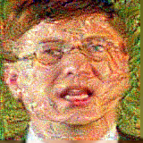
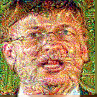

♪ README README README a man of the midnight! ♪ 
Amit Segal 
Oriyan Hermoni 
 <b>anonyME© Android Application</b> 
This app's purpose is anonymizing facial images so that they are unrecognizable to face recognition ML algorithms (as part of our Hebrew University Comp. Eng. final engineering project MVP alpha). Currently the app runs AdvBox (using the Chaquopy library) behind the scenes to create adversarial attacks of 160x160, but in the future this should change. 
Currently our app runs on Android API levels 28 (Android Pie) and 29 (Android 10).   
<b>Examples:</b> 
We ran a hands-on test on a pre-trained advbox white-bo attack on FaceNet face recognition, on pictures of Bill Gates: 
<b>Original</b> 
 
<b>Two different corrupted versions:</b> 
 

